# MIDI Control

A [Blish HUD](https://blishhud.com/) module that maps MIDI controller input to keyboard keypresses for playing instruments in Guild Wars 2.

Originally developed as a standalone Electron app ([midi-to-game-instruments](https://github.com/davidlukerice/midi-to-game-instruments)), this is a native Blish HUD port that runs directly inside the GW2 overlay.

## Data Flow

Your MIDI controller connects to Guild Wars 2 through a chain of components that keep each concern isolated:

```mermaid
flowchart LR
    subgraph Input["MIDI Input"]
        Device["MIDI Hardware"]
        MidiIn["NAudio MidiIn\n(background thread)"]
    end

    subgraph Processing["Blish HUD Game Thread"]
        Queue["Thread-safe Queue"]
        Mod["Module.Update()\n(once/tick)"]
        KS["KeySender"]
    end

    subgraph Output["Key Output"]
        KSQueue["BlockingCollection"]
        KST["KeySendThread\n(background thread)"]
        SI["SendInput\n(user32.dll)"]
        GW2["Guild Wars 2"]
    end

    Device -->|MIDI messages| MidiIn
    MidiIn -->|enqueue| Queue
    Queue -->|dequeue| Mod
    Mod --> KS
    KS -->|"SendAction[]"| KSQueue
    KSQueue -->|consume| KST
    KST -->|scan codes| SI
    SI --> GW2
```

1. **MIDI Input** — NAudio opens the selected device and collects `NoteOn`/`NoteOff` messages on a background thread. Events are placed into a `ConcurrentQueue`.
2. **Blish HUD Game Thread** — Once per `Update()` tick, the module drains the queue into `KeySender`, which runs the active keymap's octave-shift logic (auto-swap, alt-octave, multi-shift delay) and produces `SendAction`s.
3. **Key Output** — `KeySendThread` dequeues each `SendAction` and calls `SendInput` with scan codes. KeyTap sends down+up back-to-back; multi-octave shifts insert a configurable sleep between shift presses.

## Features

- **MIDI to keyboard mapping** — Play GW2 instruments with a real MIDI keyboard or controller.
- **Auto octave swap** — Automatically tracks the current in-game octave and shifts up/down (`9`/`0`) when a note is outside the current range. Configurable delay for multi-octave jumps.
- **Built-in instrument keymaps** — Pre-configured mappings for GW2 instruments (starting with The Minstrel).
- **Toggle keybind** — A configurable global keybind to quickly enable or disable note sending.
- **Focus guard** — Optionally block all keypresses when Guild Wars 2 is not in focus.

## Requirements

- Guild Wars 2
- [Blish HUD](https://blishhud.com/)
- A MIDI input device

## GW2 Policy

Per [ArenaNet's macro policy](https://en-forum.guildwars2.com/discussion/65554/policy-macros-and-macro-use):

> You may use music macros to compose or perform in-game music. As long as the macro is used solely for the composition or performance of in-game music and the account is actively attended by a player, we do not place restrictions on its use.

Use at your own risk. This tool is for music performance only and has no affiliation with Guild Wars 2 or ArenaNet.
